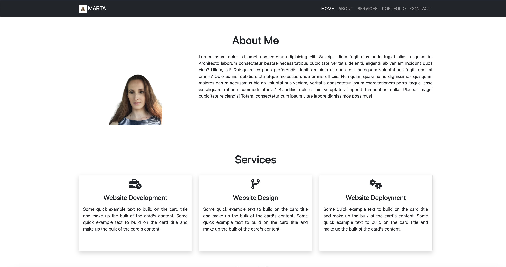
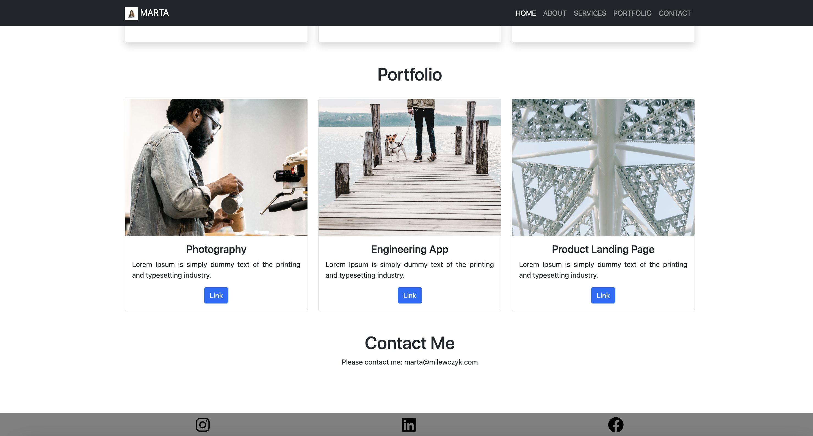

## Description

Portfolio profile created with use of Bootstrap 5.1.3.

  ---

  ## Table of contents

  - [Installation](#installation)
  - [Usage](#usage)
  - [Credits](#credits)
  - [License](#license)
  - [Contribution](#contribution)
  - [Tests](#tests)
  - [Questions](#questions)
   

  ---

  ## Installation

Application is deployed in <a href="https://martamilewczyk.github.io/challenge-3-bootstrap-portfolio/">Github</a>

---

  ## Usage

Application view 

  ---

  ## Credits
  
Creators and third-party assets that require attribution: 
- <a href="https://getbootstrap.com/docs/5.1/getting-started/introduction/">Bootstrap 5.1.3</a>
- <a href="https://coding-boot-camp.github.io/full-stack/github/professional-readme-guide">Professional README guide</a>

---

## License

  Project is covered by 
   

  ---

  ## Contribution

Please visit <a href="https://www.contributor-covenant.org/">Contributor Covenant</a> to check contribution guidelines.

  ---

  ## Tests

  Feel free to test application and in case of any suggestions please contact via e-mail.

  ---

  ## Questions
  
  In case of any questions please contact via e-mail: marta.milewczyk@pm.me. 
  For other github repositories please visit: https://github.com/MartaMilewczyk 

  ---
